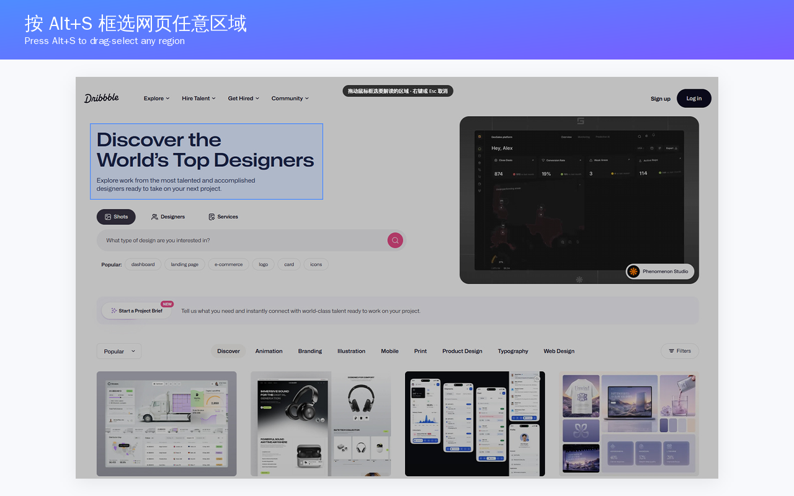
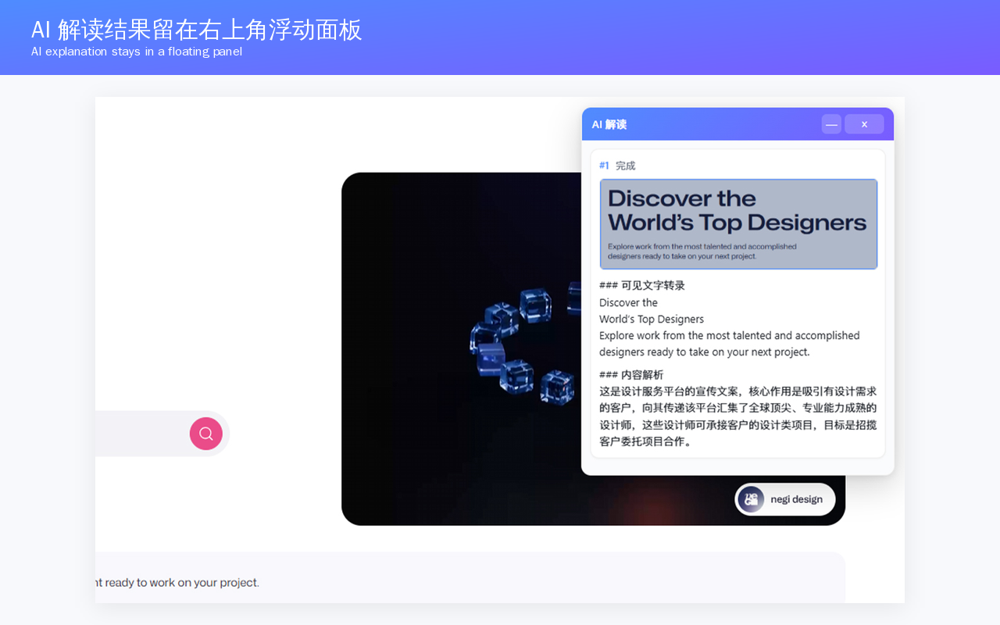
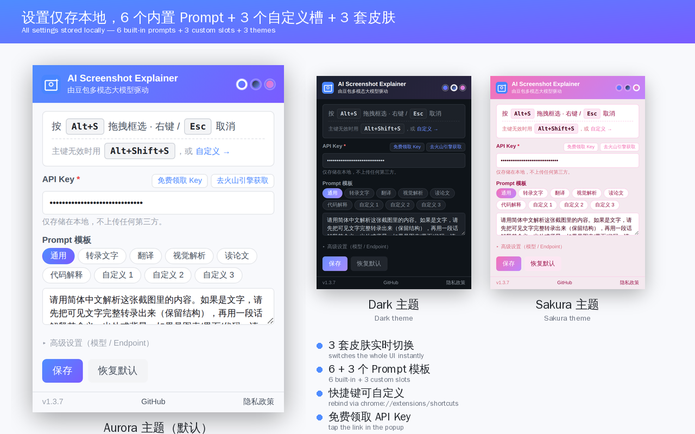
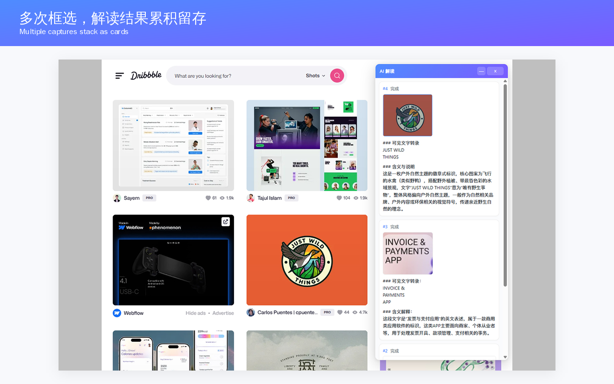

# AI 截图解读 · Doubao Screenshot Explainer

> 在任意网页按 **Alt+S** 拖拽框选，豆包多模态 AI 自动解读截图内容，结果留在右上角浮动面板——不打断浏览。


---

## 截图

| 框选任意区域 | AI 浮动面板解读 |
|---|---|
|  |  |
| **本地存储设置** | **多次框选累积留存** |
|  |  |

---

## 功能

- **快捷键触发框选**：默认 `Alt+S`，也支持点击扩展图标 / 右键菜单 "用 AI 解读这块区域"
- **拖拽框选**：跟系统截图一样的体验，**右键** 或 `Esc` 取消
- **后台异步解析**：调用 API 期间面板显示 "分析中…"，可继续滚动浏览
- **多任务面板**：右上角浮动面板可拖动、可折叠、可关闭，每次框选累积一张卡片（缩略图 + 解析文本）
- **本地存储配置**：API Key / 模型 / Endpoint / 默认 Prompt 都在弹窗里改，存于 `chrome.storage.local`，不上传任何第三方

## 适合谁

- 看英文 / 日文 / 代码截图想快速理解
- 看到图表、错误信息、术语想直接问 AI
- 不想为了问一个问题切到 ChatGPT 上传图片

---

## 安装

### 方式一：Chrome 应用商店（审核中）

正在审核中，通过后会贴出商店链接。

### 方式二：开发者模式（立即可用）

```bash
git clone https://github.com/zzf-love/DOUBAO-Chrome-extension.git
```

1. 打开 `chrome://extensions`
2. 右上角打开 **开发者模式**
3. 点 **加载已解压的扩展程序**，选择 `DOUBAO-Chrome-extension/` 目录
4. 点扩展图标，填入你自己的 [火山方舟 API Key](https://www.volcengine.com/product/ark)（`ark-` 开头）→ 保存

---

## 使用

1. 在任意网页按 **`Alt+S`**
2. 鼠标拖拽框选你想问的区域
3. 几秒后，右上角浮动面板出现 AI 解读结果
4. 同一页面可以连续框选多次，每次结果都会作为一张卡片留存

---

## 接口

默认请求火山方舟 (ARK) 的 Responses API：

```http
POST https://ark.cn-beijing.volces.com/api/v3/responses
Authorization: Bearer <API_KEY>

{
  "model": "doubao-seed-2-0-mini-260428",
  "input": [
    { "role": "user", "content": [
        { "type": "input_image", "image_url": "data:image/png;base64,..." },
        { "type": "input_text",  "text": "请用简体中文解析这张截图里的内容..." }
    ]}
  ]
}
```

模型 / Endpoint 都可在弹窗里改，理论兼容任何 OpenAI Responses 风格的视觉模型 API。

---

## 文件结构

```
manifest.json         # MV3 清单（权限、快捷键、host_permissions）
background.js         # service worker：截屏、调用 AI API
content.js / .css     # 注入页面：框选 UI、裁剪图像、结果面板
popup.html / .js      # 设置弹窗
privacy.html          # 隐私政策页（GitHub Pages 托管）
icons/                # 16/48/128px 图标
store/                # CWS 上架素材（4 张截图 + 1 张宣传图）
STORE_LISTING.md      # CWS 商店详情页文案
```

---

## 隐私

- 截图只发往你在设置里配置的 endpoint（默认火山方舟）
- API Key 只存在本地 `chrome.storage.local`，扩展不上传、不收集、不分析任何浏览数据
- 完整隐私政策：<https://zzf-love.github.io/DOUBAO-Chrome-extension/privacy.html>

---

## 版本

- **v1.1.2**：缩短 manifest description 至 132 字以内（CWS 上传要求）
- **v1.1.1**：浮动面板"关闭"按钮加宽到 48px，更易点击
- **v1.1.0**：产品化（添加图标、移除硬编码 Key、收窄 host 权限、生成隐私政策页）
- **v1.0**：初版，Doubao Seed 2.0 Responses API + Alt+S 框选

## 许可

MIT

## 反馈 / Bug

[GitHub Issues](https://github.com/zzf-love/DOUBAO-Chrome-extension/issues)
